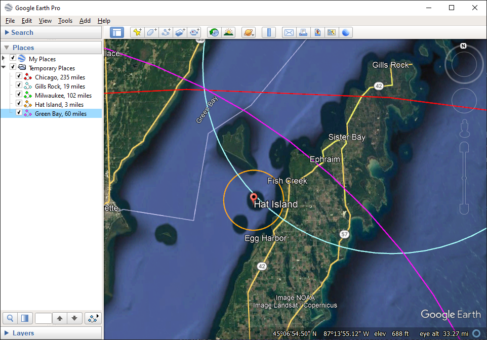

# Where in the World?
- **Author:** lgactna/Lloyd Gonzales
- **Tools used:** Google Earth Pro
- **Description:** Triangulation of a place given specific locations and distances.

## Details 
- **Competition:** MetaCTF 2021
- **Scope:** Public
- **Category:** Forensics and OSINT
- **Subcategory:** Geoguessr style problems

## Prompt 
> I must say, every time I see one of these directional signs, I think I've got to make this into a CTF problem. It's the idea of Open Source Intelligence (OSINT) or Geospatial Intelligence (GEOINT). The idea of being able to take an image and use all of the clues within it to infer details such as where it's at or what's happening in the photo. 
> 
> Here is [one such picture](https://metaproblems.com/a7b51e5b1708e4eb6d1722795547b152/sign_of_cities.png) of those signs. Your goal? Use those little details to find the name of the marina it's at which you'll submit for the flag (so MetaCTF{name of marina}).

**[Additional files](Assets/Direction-sign):** sign_of_cities.png
![[Assets/Direction-sign/sign_of_cities.png]]

## Solution 
Well, let's start with the typical approach of reverse image searching it, just in case. 

No dice. So the next approach is to see if there are any distinct words that would immediately identify this place. However, we're located smack in front of this sign, so there's nothing like a highway marker or a nearby business to go off of. We do know (based on the city names and reasonable estimates of distances) that this sign is probably located somewhere in the United States.

The sign itself has place locations and distances to those places. It should be possible to triangulate the location by drawing circles of certain radii around each city/point described by the sign. So let's do that with the following points on the sign:
- Chicago, 235 miles
- Milwaukee, 102 miles
- Hat Island, 3 miles 
- Gills Rock, 19 miles
- Green Bay, 60 miles

To draw the circles, I'll use [Google Earth Pro](https://www.google.com/earth/versions/) using [the method described in this GIS Stack Exchange post](https://gis.stackexchange.com/questions/277844/drawing-circle-in-google-earth-around-point). You can also use other tools to generate the circles; I originally used Google My Maps and its ruler functionality, but Google Earth Pro makes things a lot clearer.

Here's the result of mapping those five points, which were each obtained by using Google Earth's default result for where "the entire city of Chicago/Milwaukee/etc" was:

Three of the points seem to suggest that it's located in the middle of the Green Bay, part of Lake Michigan. There isn't even land there, but we at least know we're probably close to the right location. It's safe to say that the sign measured off of something different than what we did, but it's still close enough.

There's actually multiple Hat Islands near Chicago and Milwaukee, but once you plot a few points it becomes obvious which Hat Island the sign refers to. And that's important because it has such a small radius; in other words, once we've figured out where the correct Hat Island is, we're within about 3 miles of the correct marina.

So, let's go to Google Maps and look up "marinas near hat island wi":

There's actually not that many marinas, and given our 50-guess limit for MetaCTF, we could realistically just start guessing all of the marinas that are within about 5 miles of Hat Island, and just keep working our way up the coast.

But let's pretend we die if we put in the wrong answer. We can start looking up directional signs at each of these marinas. After looking up "egg harbor marina directional sign", we get an image that's definitely of the directional sign:

Interestingly, there aren't any other similar-looking directional signs nearby. Worth noting is that there were a lot of pictures of this sign prior to the competition (with the exact phrase "directional sign"), though Google started autocompleting "egg harbor directional sign location."

At this point, we know for a fact the flag is definitely **MetaCTF{Egg Harbor}.** That said, after flipping through a few Pinterest posts, the address of this sign turns out to be around 7815 Dock Rd, Egg Harbor, WI 54209-9628. And indeed, if you look at a user-made Street View image nearby:

It's the exact same image!